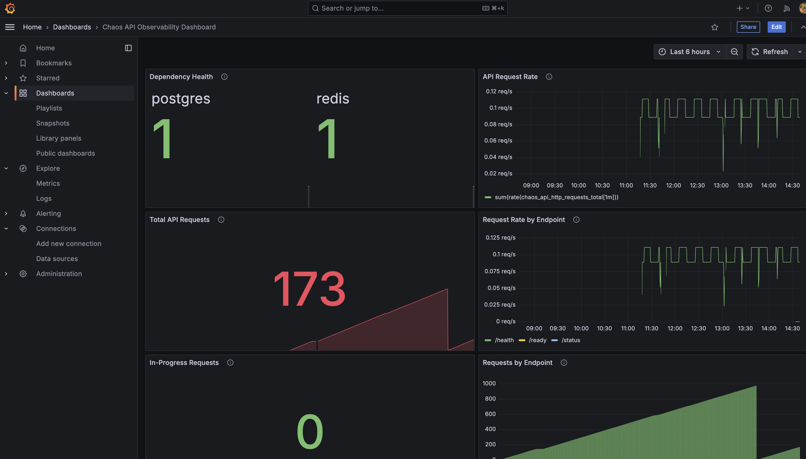
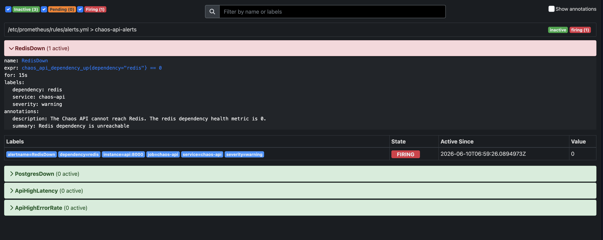
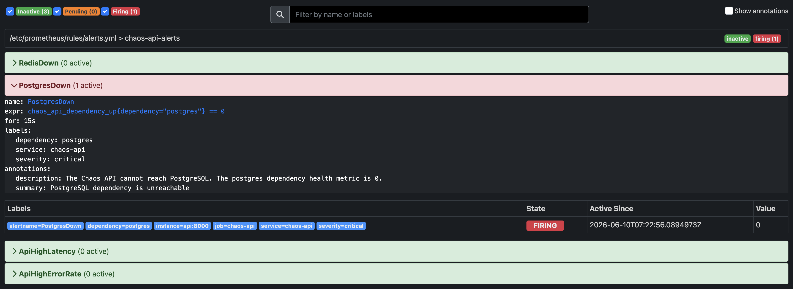
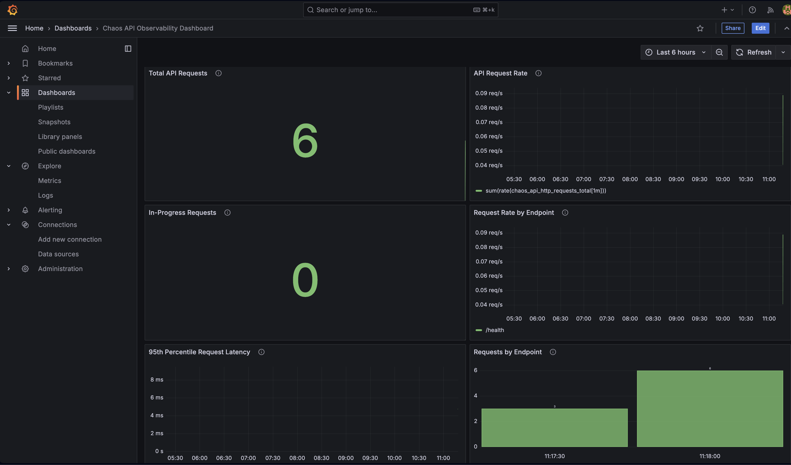
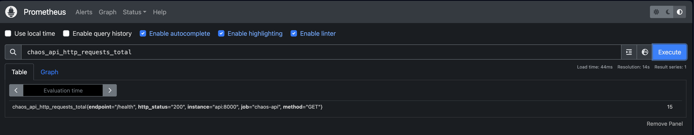
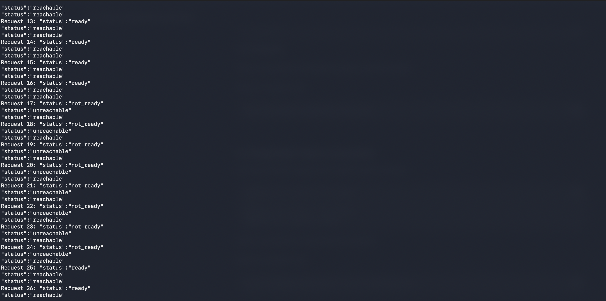

[](https://github.com/AnarkeyV/chaos-engineering-sandbox/actions/workflows/ci.yml)
[](https://www.python.org/)
[](https://fastapi.tiangolo.com/)
[](https://www.docker.com/)
[](https://kubernetes.io/)
[](https://prometheus.io/)
[](https://grafana.com/)
[](https://www.postgresql.org/)
[](https://redis.io/)
[](#reusable-availability-test-script)
[](#current-project-status)

# ⚡ Chaos Engineering Sandbox — DevOps, Kubernetes & Observability Project

A hands-on DevOps, Cloud Support, and Site Reliability Engineering portfolio project focused on **building, monitoring, breaking, recovering, validating, and improving** a cloud-native system.

This project demonstrates how a small microservices-style application can be containerised with Docker, tested through GitHub Actions, deployed locally with Kubernetes using Kind, connected to PostgreSQL and Redis, monitored with Prometheus and Grafana, and validated through controlled failure testing.

---

## 📋 Table of Contents

- [Current Project Status](#current-project-status)
- [Project Overview](#project-overview)
- [Why I Built This](#why-i-built-this)
- [Key Features](#key-features)
- [Architecture](#architecture)
- [Tech Stack](#tech-stack)
- [Application Endpoints](#application-endpoints)
- [Local Development](#local-development)
- [Automated Testing](#automated-testing)
- [Docker Build and Local Test](#docker-build-and-local-test)
- [Docker Compose Multi-Service Setup](#docker-compose-multi-service-setup)
- [Dependency Readiness Checks](#dependency-readiness-checks)
- [Kubernetes Local Deployment](#kubernetes-local-deployment)
- [Kubernetes Resilience Tests](#kubernetes-resilience-tests)
- [Kubernetes Redis Failure Test](#kubernetes-redis-failure-test)
- [Kubernetes PostgreSQL Failure Test](#kubernetes-postgresql-failure-test)
- [Dependency Failure Comparison](#dependency-failure-comparison)
- [Two-Replica Availability Test](#two-replica-availability-test)
- [Reusable Availability Test Script](#reusable-availability-test-script)
- [Observability with Prometheus and Grafana](#observability-with-prometheus-and-grafana)
- [Grafana Dashboard](#grafana-dashboard)
- [Dependency Health Metric](#dependency-health-metric)
- [Prometheus Alerting Rules](#prometheus-alerting-rules)
- [Screenshots / Evidence](#screenshots--evidence)
- [Incident Reports](#incident-reports)
- [GitHub Actions CI](#github-actions-ci)
- [Project Structure](#project-structure)
- [DevOps and Cloud Skills Demonstrated](#devops-and-cloud-skills-demonstrated)
- [Future Improvements](#future-improvements)
- [Useful Commands](#useful-commands)
- [License](#license)

---

## ✅ Current Project Status

The project has completed local Docker, Docker Compose, CI, Kubernetes deployment, resilience testing, dependency failure testing, reusable availability testing, and observability milestones.

| Area | Status |
|---|---|
| Public GitHub repository | Completed |
| Portfolio-style README | Updated |
| Project roadmap documentation | Completed |
| Architecture notes | Completed |
| FastAPI backend service | Completed |
| API health/status/readiness endpoints | Completed |
| API `/metrics` endpoint | Completed |
| pytest automated tests | Completed |
| GitHub Actions CI | Passing |
| Dockerfile | Completed |
| Docker image build check in CI | Completed |
| Docker Compose local setup | Completed |
| PostgreSQL service | Added |
| Redis service | Added |
| Docker Compose health checks | Added |
| API dependency checks for PostgreSQL and Redis | Completed |
| Manual Redis failure test in Docker Compose | Completed |
| Local Kind Kubernetes cluster | Completed |
| Kubernetes namespace | Completed |
| Kubernetes API Deployment and Service | Completed |
| Kubernetes PostgreSQL Deployment and Service | Completed |
| Kubernetes Redis Deployment and Service | Completed |
| Kubernetes liveness and readiness probes | Completed |
| API pod failure test | Completed |
| API replica improvement from 1 to 2 replicas | Completed |
| Two-replica live availability test | Passed — 60/60 HTTP 200 responses |
| Kubernetes Redis failure test | Passed — Redis pod recreated successfully |
| Redis readiness interruption observed | No visible interruption during 1-second polling |
| Kubernetes PostgreSQL failure test | Passed — readiness degradation detected and recovered |
| PostgreSQL failure window | Request 17–24 `not_ready`, request 25 recovered |
| Reusable availability test script | Completed |
| `/health` script validation | Passed — 60/60 successful requests |
| `/ready` script validation | Passed — 30/30 successful requests |
| Prometheus service | Completed |
| Prometheus API metrics scraping | Completed |
| Grafana service | Completed |
| Grafana Prometheus datasource | Completed |
| Grafana observability dashboard | Completed |
| Dashboard JSON export | Completed |
| Screenshot evidence | Added |
| Dependency health metric | Added and validated |
| Grafana Dependency Health panel | Added |
| Redis failure metric validation | Passed — Redis changed from `1.0` to `0.0` and recovered to `1.0` |
| Prometheus alerting rules | Added and validated |
| RedisDown alert validation | Passed — alert fired after Redis failure and returned to OK after recovery |
| PostgresDown alert validation | Passed — alert fired after PostgreSQL failure and returned to OK after recovery |
| Alert rules documentation | Added |
| Incident-style resilience reports | 6 reports completed |
| Current API image version | `chaos-api:0.3.0` |
| Current API replicas in Kubernetes | `2` |

---

## 📖 Project Overview

The Chaos Engineering Sandbox is a practical learning project designed to demonstrate how modern cloud-native systems behave under failure.

Instead of only proving that an application works, this project focuses on:

```text
Can the system detect failure?
Can the system recover?
Can we observe what happened?
Can we improve the design after testing?
Can users still reach the service while recovery happens?
Can dependencies recover when they fail?
Can readiness checks identify which dependency is broken?
Can we repeat tests using a reusable script?
Can we visualise system behaviour using monitoring tools?
Can we document the results clearly?
```

The project begins with a small FastAPI service, then gradually evolves into a multi-service system with:

- API service
- PostgreSQL database dependency
- Redis cache dependency
- Docker containerisation
- Docker Compose local orchestration
- GitHub Actions CI
- Kubernetes local deployment using Kind
- Readiness and liveness probes
- Manual failure tests
- Kubernetes dependency failure testing
- Incident-style documentation
- Availability validation during pod failure
- Reusable availability testing script
- Prometheus metrics collection
- Grafana observability dashboard

---

## 🎯 Why I Built This

I built this project to deepen my understanding of DevOps, Cloud Support, Kubernetes, observability, and reliability engineering.

In real-world systems, failure is unavoidable.

Applications can crash. Containers can stop. Databases can become unavailable. Cache services can fail. Network latency can increase. Deployments can go wrong.

This sandbox allows me to safely test failure scenarios, observe system behavior, improve the design, and document how the system recovers.

The goal is to build a portfolio project that demonstrates practical skills relevant to:

- DevOps Engineer roles
- Cloud Support Engineer roles
- Platform Engineering roles
- Site Reliability Engineering roles
- Infrastructure and Operations roles

---

## ✨ Key Features

| Feature | Description |
|---|---|
| **FastAPI Backend** | Simple API service used for health, readiness, metrics, and failure testing |
| **Health Endpoint** | `/health` confirms that the API process is alive |
| **Readiness Endpoint** | `/ready` checks whether PostgreSQL and Redis are reachable |
| **Status Endpoint** | `/status` shows service version, environment, features, and dependencies |
| **Metrics Endpoint** | `/metrics` exposes Prometheus-compatible metrics |
| **Work Simulation Endpoint** | `/simulate-work` creates artificial processing delay |
| **Automated Tests** | pytest validates API endpoints |
| **GitHub Actions CI** | Runs tests and Docker image build checks on push |
| **Dockerfile** | Packages the API as a container image |
| **Docker Compose** | Runs API, PostgreSQL, Redis, Prometheus, and Grafana locally |
| **Docker Compose Health Checks** | Tracks service health for API, PostgreSQL, and Redis |
| **PostgreSQL Dependency** | Simulates a persistent database dependency |
| **Redis Dependency** | Simulates a cache dependency |
| **Manual Redis Failure Test** | Validates that the API detects Redis failure in Docker Compose |
| **Kind Kubernetes Cluster** | Runs Kubernetes locally using Docker |
| **Kubernetes Manifests** | Deploys API, PostgreSQL, and Redis to Kubernetes |
| **Liveness Probe** | Helps Kubernetes know whether containers are alive |
| **Readiness Probe** | Helps Kubernetes know whether containers are ready for traffic |
| **API Pod Failure Test** | Demonstrates Kubernetes API pod recovery |
| **Redis Pod Failure Test** | Demonstrates Kubernetes Redis pod recovery |
| **PostgreSQL Pod Failure Test** | Demonstrates database failure detection and recovery |
| **Replica Improvement** | Scales API from 1 replica to 2 replicas for better resilience |
| **Live Availability Test** | Sends requests while deleting one API pod |
| **Reusable Test Script** | Automates request checks and prints success/failure summary |
| **Prometheus Monitoring** | Scrapes and stores API metrics |
| **Prometheus Alerting Rules** | Detects dependency failure, high latency, and API 5xx errors |
| **Dependency Health Metric** | Exposes PostgreSQL and Redis health as Prometheus Gauge values |
| **Grafana Dashboard** | Visualises request count, request rate, latency, and active requests |
| **Incident Reports** | Documents failure tests, results, lessons learned, and improvements |

---

## 🏗️ Architecture

### Current Docker Compose Architecture

```text
Local Machine
│
├── Docker Compose
│   │
│   ├── chaos-api
│   │   ├── /health
│   │   ├── /ready
│   │   ├── /status
│   │   ├── /metrics
│   │   └── /simulate-work
│   │
│   ├── chaos-postgres
│   │   └── PostgreSQL database dependency
│   │
│   ├── chaos-redis
│   │   └── Redis cache dependency
│   │
│   ├── chaos-prometheus
│   │   └── Scrapes chaos-api:/metrics
│   │
│   └── chaos-grafana
│       └── Visualises Prometheus metrics
│
└── Browser / curl
    ├── API:        http://127.0.0.1:8000
    ├── Prometheus: http://127.0.0.1:9090
    └── Grafana:    http://127.0.0.1:3000
```

### Current Kubernetes Architecture

```text
Kind Local Kubernetes Cluster
│
└── Namespace: chaos-sandbox
    │
    ├── Deployment: chaos-api
    │   ├── Replica 1: chaos-api pod
    │   ├── Replica 2: chaos-api pod
    │   ├── Liveness probe: /health
    │   └── Readiness probe: /ready
    │
    ├── Service: chaos-api-service
    │   └── ClusterIP service on port 8000
    │
    ├── Deployment: chaos-postgres
    │   ├── PostgreSQL pod
    │   ├── Liveness probe: pg_isready
    │   └── Readiness probe: pg_isready
    │
    ├── Service: postgres
    │   └── ClusterIP service on port 5432
    │
    ├── Deployment: chaos-redis
    │   ├── Redis pod
    │   ├── Liveness probe: redis-cli ping
    │   └── Readiness probe: redis-cli ping
    │
    └── Service: redis
        └── ClusterIP service on port 6379
```

### Observability Flow

```text
User / curl / availability script
 ↓
chaos-api
 ↓
/metrics endpoint
 ↓
Prometheus scrapes metrics
 ↓
Grafana queries Prometheus
 ↓
Dashboard visualises API behaviour
```

### Resilience Testing Flow

```text
Deploy system
 ↓
Confirm healthy state
 ↓
Inject controlled failure
 ↓
Send or observe requests during failure
 ↓
Confirm dependency impact
 ↓
Confirm Kubernetes recovery
 ↓
Observe metrics
 ↓
Document evidence
 ↓
Improve system design
```

---

## 🛠️ Tech Stack

| Area | Technology |
|---|---|
| Backend API | Python, FastAPI |
| API Server | Uvicorn |
| Testing | pytest, FastAPI TestClient, httpx |
| PostgreSQL Driver | Psycopg 3 |
| Cache Client | redis-py |
| Metrics Client | prometheus-client |
| Containers | Docker |
| Local Multi-Service Runtime | Docker Compose |
| CI | GitHub Actions |
| Local Kubernetes | Kind |
| Kubernetes CLI | kubectl |
| Database | PostgreSQL |
| Cache | Redis |
| Monitoring | Prometheus |
| Dashboarding | Grafana |
| Scripting | Bash, curl, awk |
| Documentation | Markdown |
| Future Chaos Tooling | LitmusChaos or Chaos Mesh |

---

## 📡 Application Endpoints

| Endpoint | Method | Purpose |
|---|---|---|
| `/` | `GET` | Root endpoint with API message |
| `/health` | `GET` | Confirms the API process is alive |
| `/ready` | `GET` | Confirms API dependency readiness |
| `/status` | `GET` | Shows service version, environment, features, and dependencies |
| `/metrics` | `GET` | Exposes Prometheus-compatible metrics |
| `/simulate-work` | `GET` | Simulates a small amount of processing work |
| `/docs` | `GET` | FastAPI interactive documentation |

### Key custom metrics

| Metric | Purpose |
|---|---|
| `chaos_api_http_requests_total` | Counts API requests by method, endpoint, and status code |
| `chaos_api_http_request_duration_seconds` | Tracks request latency |
| `chaos_api_http_requests_in_progress` | Shows current in-progress API requests |
| `chaos_api_dependency_up` | Shows PostgreSQL and Redis dependency health using `1` for reachable and `0` for unreachable |

---

## 💻 Local Development

### Prerequisites

Install the following:

- Git
- Python 3.12 or later
- Docker Desktop
- VS Code or another code editor

### 1. Clone the repository

```bash
git clone https://github.com/AnarkeyV/chaos-engineering-sandbox.git
cd chaos-engineering-sandbox
```

### 2. Create a virtual environment

```bash
python3 -m venv .venv
```

### 3. Activate the virtual environment

```bash
source .venv/bin/activate
```

### 4. Install dependencies

```bash
pip install -r app/api/requirements.txt
```

### 5. Run the API locally

```bash
uvicorn app.api.main:app --reload --port 8000
```

Useful local URLs:

```text
http://127.0.0.1:8000/health
http://127.0.0.1:8000/ready
http://127.0.0.1:8000/status
http://127.0.0.1:8000/metrics
http://127.0.0.1:8000/simulate-work
http://127.0.0.1:8000/docs
```

---

## ✅ Automated Testing

Run tests locally:

```bash
pytest
```

Expected result:

```text
6 passed
```

The tests validate:

| Test | Purpose |
|---|---|
| Root endpoint | Confirms `/` returns the correct API message |
| Health endpoint | Confirms `/health` returns healthy status |
| Ready endpoint | Confirms `/ready` returns dependency information |
| Status endpoint | Confirms `/status` returns service and feature information |
| Simulate work endpoint | Confirms `/simulate-work` returns a successful response |
| Metrics endpoint | Confirms `/metrics` exposes Prometheus metrics |

---

## 🐳 Docker Build and Local Test

Build the Docker image:

```bash
docker build -t chaos-api:0.3.0 -f app/api/Dockerfile .
```

Run the container:

```bash
docker run --name chaos-api-container -p 8000:8000 chaos-api:0.3.0
```

Open:

```text
http://127.0.0.1:8000/health
```

Stop the container:

```text
Control + C
```

Remove the container:

```bash
docker rm chaos-api-container
```

---

## 🧱 Docker Compose Multi-Service Setup

Start the full local system:

```bash
docker compose up --build
```

Expected services:

```text
chaos-api
chaos-postgres
chaos-redis
chaos-prometheus
chaos-grafana
```

Useful local URLs:

| Service | URL |
|---|---|
| API | `http://127.0.0.1:8000` |
| API metrics | `http://127.0.0.1:8000/metrics` |
| Prometheus | `http://127.0.0.1:9090` |
| Grafana | `http://127.0.0.1:3000` |

Check readiness:

```text
http://127.0.0.1:8000/ready
```

Expected result:

```text
status: ready
database: reachable
cache: reachable
```

Stop the system:

```text
Control + C
```

Clean up:

```bash
docker compose down
```

---

## 🔍 Dependency Readiness Checks

The API includes real dependency checks for PostgreSQL and Redis.

| Endpoint | Meaning |
|---|---|
| `/health` | The API process is alive |
| `/ready` | The API and its dependencies are ready |
| `/status` | The API reports its environment, features, and dependency state |
| `/metrics` | The API exposes metrics for Prometheus |

PostgreSQL check:

```sql
SELECT 1;
```

Redis check:

```text
PING
```

This is an important design choice because a service can be alive but still not ready to serve real traffic.

---

## ☸️ Kubernetes Local Deployment

This project uses **Kind** to run a local Kubernetes cluster.

Create a Kind cluster:

```bash
kind create cluster --name chaos-sandbox
```

Build the API image:

```bash
docker build -t chaos-api:0.3.0 -f app/api/Dockerfile .
```

Load the image into Kind:

```bash
kind load docker-image chaos-api:0.3.0 --name chaos-sandbox
```

Apply Kubernetes manifests:

```bash
kubectl apply -f k8s/namespace.yaml
kubectl apply -f k8s/postgres-deployment.yaml
kubectl apply -f k8s/postgres-service.yaml
kubectl apply -f k8s/redis-deployment.yaml
kubectl apply -f k8s/redis-service.yaml
kubectl apply -f k8s/api-deployment.yaml
kubectl apply -f k8s/api-service.yaml
```

Check pods:

```bash
kubectl get pods -n chaos-sandbox
```

Check Deployment:

```bash
kubectl get deployment chaos-api -n chaos-sandbox
```

Expected current result:

```text
NAME        READY   UP-TO-DATE   AVAILABLE
chaos-api   2/2     2            2
```

Access the API using port-forwarding:

```bash
kubectl port-forward -n chaos-sandbox service/chaos-api-service 8000:8000
```

More details are documented in:

[docs/kubernetes-local-deployment.md](docs/kubernetes-local-deployment.md)

---

## 🧪 Kubernetes Resilience Tests

### Test 1: Redis Manual Failure Test in Docker Compose

Redis was stopped manually using Docker:

```bash
docker stop chaos-redis
```

Result:

| Check | Result |
|---|---|
| API stayed alive | Yes |
| Redis failure detected | Yes |
| `/ready` changed to `not_ready` | Yes |
| Redis recovery detected | Yes |

Report:

[docs/incident-reports/01-redis-manual-failure-test.md](docs/incident-reports/01-redis-manual-failure-test.md)

---

### Test 2: Kubernetes API Pod Failure Test

The API pod was manually deleted:

```bash
kubectl delete pod <API_POD_NAME> -n chaos-sandbox
```

Result:

| Check | Result |
|---|---|
| API pod deleted | Yes |
| Kubernetes created a replacement pod | Yes |
| Deployment returned to available state | Yes |
| PostgreSQL remained running | Yes |
| Redis remained running | Yes |

Report:

[docs/incident-reports/02-kubernetes-api-pod-failure-test.md](docs/incident-reports/02-kubernetes-api-pod-failure-test.md)

---

### Test 3: API Replica Resilience Improvement

The API Deployment was improved from one replica to two replicas.

Before:

```yaml
replicas: 1
```

After:

```yaml
replicas: 2
```

Current evidence:

```text
Replicas: 2 desired | 2 updated | 2 total | 2 available | 0 unavailable
```

Report:

[docs/incident-reports/03-kubernetes-api-replica-resilience-improvement.md](docs/incident-reports/03-kubernetes-api-replica-resilience-improvement.md)

---

## 🔴 Kubernetes Redis Failure Test

Redis was tested as a Kubernetes-managed dependency.

The Redis pod was manually deleted:

```bash
kubectl delete pod <REDIS_POD_NAME> -n chaos-sandbox
```

A readiness loop was used to observe API readiness:

```bash
for i in {1..60}; do
  echo -n "Request $i: "
  curl -s http://127.0.0.1:8000/ready | grep -o '"status":"[^"]*"'
  sleep 1
done
```

Observed result:

```text
/ready loop status: all ready
```

After the Redis pod was deleted, Kubernetes created a replacement Redis pod:

```text
chaos-redis-7cb6577fc6-cln5s     1/1     Running
```

Redis Deployment after recovery:

```text
NAME          READY   UP-TO-DATE   AVAILABLE
chaos-redis   1/1     1            1
```

Result summary:

| Check | Result |
|---|---|
| Redis pod deleted manually | Yes |
| Kubernetes recreated Redis pod | Yes |
| New Redis pod reached Running state | Yes |
| Redis Deployment returned to 1/1 available | Yes |
| API pods remained running | Yes |
| `/ready` loop observed `not_ready` | No |
| `/ready` stayed ready during observed test | Yes |
| Manual Redis redeployment required | No |

Important observation:

```text
No visible readiness interruption was captured during the 1-second polling loop.
```

Report:

[docs/incident-reports/05-kubernetes-redis-failure-test.md](docs/incident-reports/05-kubernetes-redis-failure-test.md)

---

## 🟠 Kubernetes PostgreSQL Failure Test

PostgreSQL was tested as a Kubernetes-managed database dependency.

Before failure, `/ready` returned:

```text
status: ready
database: reachable
cache: reachable
```

The PostgreSQL pod was manually deleted:

```bash
kubectl delete pod <POSTGRES_POD_NAME> -n chaos-sandbox
```

A readiness loop was used to observe API readiness:

```bash
for i in {1..90}; do
  echo -n "Request $i: "
  curl -s http://127.0.0.1:8000/ready | grep -o '"status":"[^"]*"'
  sleep 1
done
```

Observed readiness impact:

```text
Request 17: "status":"not_ready"
"status":"unreachable"
"status":"reachable"

Request 18: "status":"not_ready"
"status":"unreachable"
"status":"reachable"

Request 19: "status":"not_ready"
"status":"unreachable"
"status":"reachable"

Request 20: "status":"not_ready"
"status":"unreachable"
"status":"reachable"

Request 21: "status":"not_ready"
"status":"unreachable"
"status":"reachable"

Request 22: "status":"not_ready"
"status":"unreachable"
"status":"reachable"

Request 23: "status":"not_ready"
"status":"unreachable"
"status":"reachable"

Request 24: "status":"not_ready"
"status":"unreachable"
"status":"reachable"

Request 25: "status":"ready"
```

This showed:

```text
database: unreachable
cache: reachable
```

Kubernetes recovery evidence:

```text
chaos-postgres-5d4778d86-mmfjl   0/1     Running   0   3s
chaos-postgres-5d4778d86-mmfjl   1/1     Running   0   10s
```

Final PostgreSQL Deployment state:

```text
NAME             READY   UP-TO-DATE   AVAILABLE
chaos-postgres   1/1     1            1
```

Result summary:

| Check | Result |
|---|---|
| PostgreSQL pod deleted manually | Yes |
| API stayed running | Yes |
| Redis stayed running | Yes |
| `/ready` detected PostgreSQL failure | Yes |
| `/ready` changed to `not_ready` | Yes |
| Database showed `unreachable` | Yes |
| Cache stayed `reachable` | Yes |
| Kubernetes recreated PostgreSQL pod | Yes |
| PostgreSQL pod reached `1/1 Running` | Yes |
| PostgreSQL Deployment returned to `1/1` available | Yes |
| API `/ready` returned to `ready` | Yes |
| Manual PostgreSQL redeployment required | No |

Report:

[docs/incident-reports/06-kubernetes-postgresql-failure-test.md](docs/incident-reports/06-kubernetes-postgresql-failure-test.md)

---

## 🔁 Dependency Failure Comparison

The Redis and PostgreSQL failure tests produced different readiness behavior.

| Dependency | Failure Result |
|---|---|
| Redis | No visible readiness interruption captured |
| PostgreSQL | Clear `not_ready` state observed |
| Redis recovery | Very fast during observed test |
| PostgreSQL recovery | Visible readiness impact from request 17 to request 24 |
| Redis status during PostgreSQL failure | Remained reachable |
| Database status during PostgreSQL failure | Became unreachable |
| API process | Stayed running in both tests |

This comparison is useful because it shows that different dependencies can fail and recover differently.

It also reinforces the difference between:

```text
/health = API process is alive
/ready  = API and dependencies are ready
```

---

## 🟢 Two-Replica Availability Test

The availability test continuously sent requests to the API while one API pod was deleted.

Command used:

```bash
for i in {1..60}; do
  echo -n "Request $i: "
  curl -s -o /dev/null -w "%{http_code}\n" http://127.0.0.1:8000/health
  sleep 1
done
```

Result:

| Metric | Result |
|---|---|
| Total requests | `60` |
| Successful responses | `60` |
| Failed responses | `0` |
| Success rate | `100%` |
| Endpoint tested | `/health` |
| HTTP success code | `200` |
| API replicas | `2` |

Report:

[docs/incident-reports/04-two-replica-api-availability-test.md](docs/incident-reports/04-two-replica-api-availability-test.md)

---

## 🧰 Reusable Availability Test Script

A reusable script was added so the availability test can be repeated easily.

Script location:

```text
scripts/check_api_availability.sh
```

Make the script executable:

```bash
chmod +x scripts/check_api_availability.sh
```

Run the default test:

```bash
./scripts/check_api_availability.sh
```

Default behavior:

| Setting | Default |
|---|---|
| URL | `http://127.0.0.1:8000/health` |
| Total requests | `60` |
| Delay | `1` second |

Custom usage:

```bash
./scripts/check_api_availability.sh http://127.0.0.1:8000/ready 30 1
```

### Script Validation Results

| Endpoint | Requests | Successful | Failed | Success Rate | Result |
|---|---:|---:|---:|---:|---|
| `/health` | 60 | 60 | 0 | 100.00% | PASS |
| `/ready` | 30 | 30 | 0 | 100.00% | PASS |

---

## 📊 Observability with Prometheus and Grafana

Observability was added to help monitor how the API behaves during normal use and failure testing.

### Prometheus

Prometheus is configured to scrape the API metrics endpoint:

```text
http://api:8000/metrics
```

Configuration file:

```text
observability/prometheus/prometheus.yml
```

Key Prometheus queries:

```promql
chaos_api_http_requests_total
```

```promql
sum(chaos_api_http_requests_total)
```

```promql
rate(chaos_api_http_requests_total[1m])
```

```promql
chaos_api_http_requests_in_progress
```

### Grafana

Grafana is configured with Prometheus as its default datasource.

Datasource file:

```text
observability/grafana/provisioning/datasources/prometheus.yml
```

Local Grafana URL:

```text
http://127.0.0.1:3000
```

Default local login:

```text
Username: admin
Password: admin
```

---

## 📈 Grafana Dashboard

A Grafana dashboard was created to visualise the Chaos API metrics.

Dashboard name:

```text
Chaos API Observability Dashboard
```

Dashboard export:

```text
observability/grafana/dashboards/chaos-api-observability-dashboard.json
```

Dashboard panels:

| Panel | Purpose |
|---|---|
| Total API Requests | Shows total API request count |
| API Request Rate | Shows requests per second |
| Requests by Endpoint | Shows total requests grouped by endpoint |
| Request Rate by Endpoint | Shows request rate grouped by endpoint |
| 95th Percentile Request Latency | Shows high-percentile API latency |
| In-Progress Requests | Shows active requests currently being processed |

Example dashboard validation traffic:

```bash
./scripts/check_api_availability.sh http://127.0.0.1:8000/health 20 1
./scripts/check_api_availability.sh http://127.0.0.1:8000/ready 20 1
for i in {1..5}; do curl http://127.0.0.1:8000/simulate-work; echo; done
```

---

## 🧭 Dependency Health Metric

A new Prometheus Gauge metric was added to expose direct dependency health.

Metric name:

```text
chaos_api_dependency_up
```

Metric meaning:

| Value | Meaning |
|---|---|
| `1` | Dependency is reachable |
| `0` | Dependency is unreachable |

Healthy state:

```text
chaos_api_dependency_up{dependency="postgres"} 1.0
chaos_api_dependency_up{dependency="redis"} 1.0
```

Redis failure validation:

```text
chaos_api_dependency_up{dependency="postgres"} 1.0
chaos_api_dependency_up{dependency="redis"} 0.0
```

Redis recovery validation:

```text
chaos_api_dependency_up{dependency="postgres"} 1.0
chaos_api_dependency_up{dependency="redis"} 1.0
```

Grafana dashboard panel:

```text
Dependency Health
```

Prometheus query used:

```promql
avg by (dependency) (chaos_api_dependency_up)
```

Documentation:

[docs/observability/dependency-health-metric.md](docs/observability/dependency-health-metric.md)

Screenshot evidence:



This improves troubleshooting because the system can now show which dependency is unhealthy instead of only showing that the API is not ready.

---

## 🚨 Prometheus Alerting Rules

Prometheus alerting rules were added to move the project from observability into basic operational alerting.

Alert rule file:

```text
observability/prometheus/rules/alerts.yml
```

Prometheus config:

```text
observability/prometheus/prometheus.yml
```

Configured alerts:

| Alert | Purpose | Severity |
|---|---|---|
| `RedisDown` | Fires when Redis dependency health is `0` | warning |
| `PostgresDown` | Fires when PostgreSQL dependency health is `0` | critical |
| `ApiHighLatency` | Fires when 95th percentile API latency is above 1 second | warning |
| `ApiHighErrorRate` | Fires when API returns HTTP 5xx responses | critical |

The alerts use the existing API metrics, including:

```promql
chaos_api_dependency_up
```

RedisDown validation flow:

```text
Redis stopped
 ↓
/ready returned not_ready
 ↓
chaos_api_dependency_up{dependency="redis"} changed from 1.0 to 0.0
 ↓
Prometheus evaluated RedisDown
 ↓
RedisDown alert fired after 15 seconds
 ↓
Redis restarted
 ↓
Metric returned to 1.0
 ↓
Alert returned to OK
```

Screenshot evidence:



PostgresDown validation flow:

```text
PostgreSQL stopped
 ↓
/ready returned not_ready
 ↓
chaos_api_dependency_up{dependency="postgres"} changed from 1.0 to 0.0
 ↓
Prometheus evaluated PostgresDown
 ↓
PostgresDown alert fired after 15 seconds
 ↓
PostgreSQL restarted
 ↓
Metric returned to 1.0
 ↓
Alert returned to OK
```

Screenshot evidence:



Documentation:

[docs/observability/prometheus-alerting-rules.md](docs/observability/prometheus-alerting-rules.md)

This milestone shows that the project can now detect dependency failure automatically through Prometheus alert rules instead of relying only on manual checks.

---

## 🖼️ Screenshots / Evidence

Visual evidence is included to show the application monitoring stack and failure testing results.

| Screenshot | Description |
|---|---|
|  | Grafana dashboard showing API request count, request rate, endpoint traffic, latency, and in-progress requests |
|  | Prometheus query showing API metrics scraped from the FastAPI `/metrics` endpoint |
|  | Terminal evidence showing `/ready` changing to `not_ready` during PostgreSQL failure and recovering to `ready` |
|  | Grafana panel showing PostgreSQL and Redis dependency health using the `chaos_api_dependency_up` Prometheus metric |
|  | Prometheus alert evidence showing the `RedisDown` alert firing after Redis became unreachable |
|  | Prometheus alert evidence showing the `PostgresDown` alert firing after PostgreSQL became unreachable |

These screenshots help make the project easier to review by showing the system behavior visually instead of only describing it in text.

---

## 📄 Incident Reports

Incident reports are stored in:

```text
docs/incident-reports/
```

Current reports:

| Report | Description |
|---|---|
| [01 Redis Manual Failure Test](docs/incident-reports/01-redis-manual-failure-test.md) | Documents API behavior when Redis is stopped in Docker Compose |
| [02 Kubernetes API Pod Failure Test](docs/incident-reports/02-kubernetes-api-pod-failure-test.md) | Documents Kubernetes recovery after API pod deletion |
| [03 Kubernetes API Replica Resilience Improvement](docs/incident-reports/03-kubernetes-api-replica-resilience-improvement.md) | Documents scaling API replicas from 1 to 2 |
| [04 Two-Replica API Availability Test](docs/incident-reports/04-two-replica-api-availability-test.md) | Documents 60/60 successful requests during API pod failure |
| [05 Kubernetes Redis Failure Test](docs/incident-reports/05-kubernetes-redis-failure-test.md) | Documents Redis pod deletion and Kubernetes recovery |
| [06 Kubernetes PostgreSQL Failure Test](docs/incident-reports/06-kubernetes-postgresql-failure-test.md) | Documents database failure detection and Kubernetes recovery |

---

## 🔄 GitHub Actions CI

The workflow file is located at:

```text
.github/workflows/ci.yml
```

The CI workflow performs:

1. Checkout repository
2. Set up Python
3. Install dependencies
4. Run pytest
5. Build Docker image

---

## 📁 Project Structure

```text
chaos-engineering-sandbox/
├── README.md
├── LICENSE
├── .gitignore
├── .dockerignore
├── docker-compose.yml
├── pytest.ini
├── app/
│   ├── __init__.py
│   └── api/
│       ├── __init__.py
│       ├── Dockerfile
│       ├── main.py
│       └── requirements.txt
├── tests/
│   └── test_api.py
├── docs/
│   ├── architecture-notes.md
│   ├── project-roadmap.md
│   ├── kubernetes-local-deployment.md
│   ├── screenshots/
│   │   ├── dependency-health-panel.png
│   │   ├── grafana-dashboard.png
│   │   ├── postgresql-failure-readiness.png
│   │   ├── prometheus-query.png
│   │   ├── prometheus-redisdown-alert.png
│   │   └── prometheus-postgresdown-alert.png
│   ├── observability/
│   │   ├── dependency-health-metric.md
│   │   └── prometheus-alerting-rules.md
│   └── incident-reports/
│       ├── 01-redis-manual-failure-test.md
│       ├── 02-kubernetes-api-pod-failure-test.md
│       ├── 03-kubernetes-api-replica-resilience-improvement.md
│       ├── 04-two-replica-api-availability-test.md
│       ├── 05-kubernetes-redis-failure-test.md
│       └── 06-kubernetes-postgresql-failure-test.md
├── k8s/
│   ├── namespace.yaml
│   ├── api-deployment.yaml
│   ├── api-service.yaml
│   ├── postgres-deployment.yaml
│   ├── postgres-service.yaml
│   ├── redis-deployment.yaml
│   └── redis-service.yaml
├── scripts/
│   └── check_api_availability.sh
├── observability/
│   ├── prometheus/
│   │   ├── prometheus.yml
│   │   └── rules/
│   │       └── alerts.yml
│   └── grafana/
│       ├── dashboards/
│       │   └── chaos-api-observability-dashboard.json
│       └── provisioning/
│           └── datasources/
│               └── prometheus.yml
└── .github/
    └── workflows/
        └── ci.yml
```

---

## 📈 DevOps and Cloud Skills Demonstrated

| Skill Area | Tools / Practices |
|---|---|
| Version Control | Git, GitHub, commits, public repository |
| Documentation | README, architecture notes, roadmap, incident reports |
| Backend Development | Python, FastAPI |
| API Health Design | `/health`, `/ready`, `/status`, `/metrics` |
| Automated Testing | pytest |
| CI | GitHub Actions |
| Containerisation | Docker, Dockerfile |
| Local Orchestration | Docker Compose |
| Databases | PostgreSQL dependency check |
| Caching | Redis dependency check |
| Kubernetes | Kind, kubectl, Namespace, Deployment, Service |
| Reliability | Liveness probes, readiness probes, replicas |
| Failure Testing | Redis failure, API pod deletion, Redis pod deletion, PostgreSQL pod deletion |
| Dependency Testing | Redis and PostgreSQL recovery inside Kubernetes |
| Availability Testing | 60-request live test during pod failure |
| Scripting | Bash availability test script |
| Monitoring | Prometheus metrics scraping |
| Alerting | Prometheus rules for dependency failure, latency, and 5xx errors |
| Dashboarding | Grafana dashboard panels |
| Recovery Analysis | Kubernetes desired state and pod recreation |
| Resilience Improvement | API scaled from 1 replica to 2 replicas |
| Incident Documentation | Failure reports, lessons learned, improvements |
| Cloud Support Thinking | Diagnosis, dependency checks, recovery evidence |
| SRE Thinking | Availability, readiness, latency, resilience, observability |

---

## 🔮 Future Improvements

Planned next steps:

- Validate `ApiHighLatency` alert.
- Validate `ApiHighErrorRate` alert.
- Add Alertmanager integration.

- Add faster dependency polling for failure experiments.
- Add Grafana alerting for Redis and PostgreSQL connectivity.
- Add dashboard screenshots to documentation.
- Add Prometheus alerting rules.
- Add Grafana alerting.
- Add MTTR measurement.
- Add service-level indicators such as availability and latency.
- Add persistent storage for PostgreSQL.
- Add PostgreSQL StatefulSet version.
- Add LitmusChaos or Chaos Mesh for automated chaos experiments.
- Add Helm charts.
- Add Azure AKS deployment.
- Add final case study report.

---

## 🧰 Useful Commands

### Run tests

```bash
pytest
```

### Run Docker Compose

```bash
docker compose up --build
```

### Stop Docker Compose

```bash
docker compose down
```

### Open Prometheus

```text
http://127.0.0.1:9090
```

### Open Grafana

```text
http://127.0.0.1:3000
```

### Create Kind cluster

```bash
kind create cluster --name chaos-sandbox
```

### Build API image

```bash
docker build -t chaos-api:0.3.0 -f app/api/Dockerfile .
```

### Load image into Kind

```bash
kind load docker-image chaos-api:0.3.0 --name chaos-sandbox
```

### Apply Kubernetes manifests

```bash
kubectl apply -f k8s/
```

### Check Kubernetes pods

```bash
kubectl get pods -n chaos-sandbox
```

### Check API Deployment

```bash
kubectl get deployment chaos-api -n chaos-sandbox
```

### Check Redis Deployment

```bash
kubectl get deployment chaos-redis -n chaos-sandbox
```

### Check PostgreSQL Deployment

```bash
kubectl get deployment chaos-postgres -n chaos-sandbox
```

### Port-forward API service

```bash
kubectl port-forward -n chaos-sandbox service/chaos-api-service 8000:8000
```

### Run reusable availability test

```bash
./scripts/check_api_availability.sh
```

### Run custom availability test

```bash
./scripts/check_api_availability.sh http://127.0.0.1:8000/ready 30 1
```

### Delete one API pod for testing

```bash
kubectl delete pod <API_POD_NAME> -n chaos-sandbox
```

### Delete Redis pod for dependency failure testing

```bash
kubectl delete pod <REDIS_POD_NAME> -n chaos-sandbox
```

### Delete PostgreSQL pod for dependency failure testing

```bash
kubectl delete pod <POSTGRES_POD_NAME> -n chaos-sandbox
```

### Watch pods recover

```bash
kubectl get pods -n chaos-sandbox -w
```

### Generate dashboard traffic

```bash
./scripts/check_api_availability.sh http://127.0.0.1:8000/health 20 1
./scripts/check_api_availability.sh http://127.0.0.1:8000/ready 20 1
for i in {1..5}; do curl http://127.0.0.1:8000/simulate-work; echo; done
```

---

## 🧠 Key Learning Summary

This project currently demonstrates the following learning journey:

```text
Create a basic API
 ↓
Add automated tests
 ↓
Add CI with GitHub Actions
 ↓
Containerise the API
 ↓
Run services with Docker Compose
 ↓
Add PostgreSQL and Redis dependencies
 ↓
Add readiness checks
 ↓
Simulate Redis failure in Docker Compose
 ↓
Deploy to local Kubernetes
 ↓
Configure liveness and readiness probes
 ↓
Delete API pod manually
 ↓
Observe Kubernetes recovery
 ↓
Scale API from 1 replica to 2 replicas
 ↓
Send live requests during pod failure
 ↓
Confirm 60/60 successful responses
 ↓
Create reusable availability test script
 ↓
Add Prometheus metrics endpoint
 ↓
Scrape metrics with Prometheus
 ↓
Visualise metrics with Grafana
 ↓
Create observability dashboard
 ↓
Export dashboard as JSON
 ↓
Delete Redis pod in Kubernetes
 ↓
Observe Redis recovery and API readiness behaviour
 ↓
Delete PostgreSQL pod in Kubernetes
 ↓
Observe database failure detection and readiness recovery
 ↓
Compare dependency failure behaviour
 ↓
Document resilience and dependency failure testing
 ↓
Add screenshot evidence for monitoring and failure results
 ↓
Add dependency health metric for PostgreSQL and Redis
 ↓
Validate Redis failure metric change from 1 to 0 and back to 1
 ↓
Add Prometheus alert rules
 ↓
Validate RedisDown alert firing and recovery
 ↓
Validate PostgresDown alert firing and recovery
```

This makes the project more than a basic deployment exercise.

It shows the full DevOps and reliability cycle:

```text
Build
Test
Deploy
Break
Detect
Recover
Improve
Validate
Observe
Automate
Document
```

---

## 📄 License

This project is licensed under the MIT License.

See:

[LICENSE](LICENSE)

---

Built by **Khairul Rizal** as a DevOps, Cloud Support, and resilience engineering portfolio project.

Last updated: June 2026
